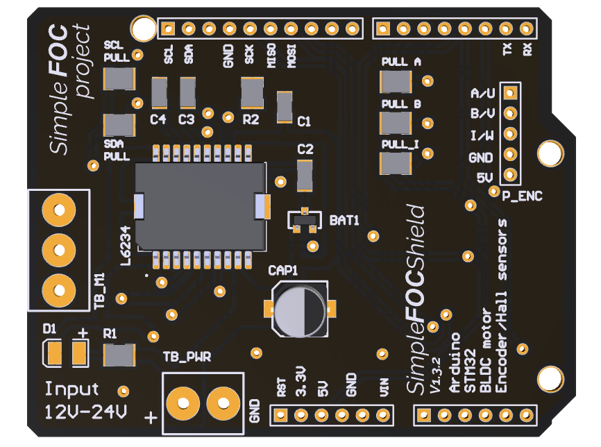
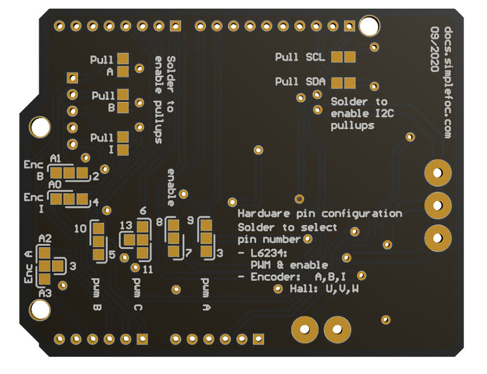
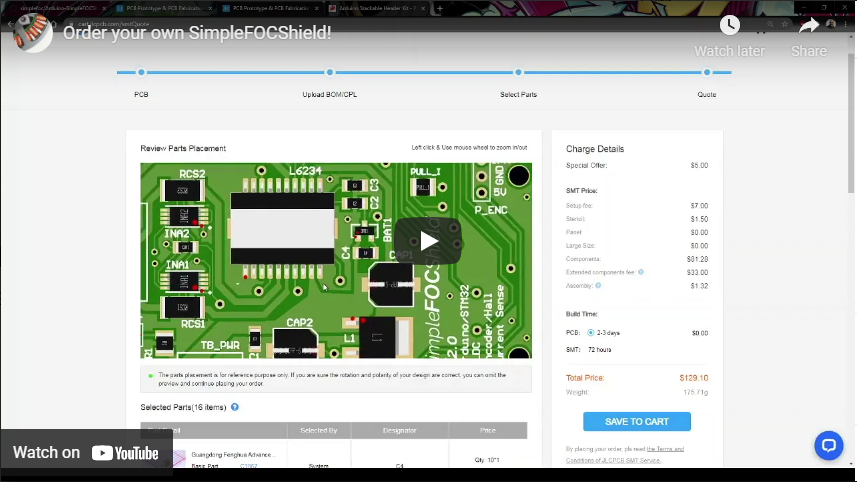

# Arduino *Simple**FOC**Shield* *v2.0.3*

This is an open-source low-cost Brushless DC (BLDC) motor driver board intended primarily for low-power FOC applications up to 5Amps. The board is fully compatible with the Arduino UNO and all the boards with the standard Arduino headers. The *Simple**FOC**Shield*, in combination with the *Simple**FOC**library* provides user-friendly way to control BLDC motors both in hardware and software. 

### Features
- **Plug & play**: In combination with Arduino *Simple**FOC**library* - [github](https://github.com/simplefoc/Arduino-FOC)
- **Low-cost**: Price of 15-20€ - [Check the pricing](https://www.simplefoc.com/simplefoc_shield_product) 
- **In-line current sensing**: Up to 3Amps/5Amps bidirectional
   - configurable: 3.3Amps - 3.3V adc, 5Amps - 5V adc
- **Integrated 8V regulator**: 
   - Enable/disable by soldering pads
- **Max power 120W** - max current 5A, power-supply 12-24V
   - Designed for Gimbal motors with the internal resistance >10 Ωs. 
- **Stackable**: running 2 motors in the same time
- **Encoder/Hall sensors interface**: Integrated 3.3kΩ pullups (configurable)
- **I2C interface**: Integrated 4.7kΩ pullups (configurable)
- **Configurable pinout**: Hardware configuration - soldering connections
- **Arduino headers**: Arduino UNO, Arduino MEGA, STM32 Nucleo boards...
- **Open Source**: Fully available fabrication files - [how to make it yourself](https://docs.simplefoc.com/arduino_simplefoc_shield_fabrication)

### Short YouTube demonstration video :D

### Short video guide to fabricating your own *Simple**FOC**Shield* 

More info on [board fabrication docs](https://docs.simplefoc.com/arduino_simplefoc_shield_fabrication).

## Board versions:

To check the release timeline, click [here](https://github.com/simplefoc/Arduino-SimpleFOCShield/releases) 

Version  |link | Release date | Comment
----- | ----- | ---- | ----
*Simple**FOC**Shield* v1.3 |[release v1.3](https://github.com/simplefoc/Arduino-SimpleFOCShield/releases/tag/v1.3) | 04/20 | Inital release
*Simple**FOC**Shield* v1.3.1 | [release v1.3.1](https://github.com/simplefoc/Arduino-SimpleFOCShield/releases/tag/v1.3.1) | 07/20 | added Nucleo stacking support
*Simple**FOC**Shield* v1.3.2 |[release v1.3.2](https://github.com/simplefoc/Arduino-SimpleFOCShield/releases/tag/v1.3.2) | 09/20 | added I2C pullups
*Simple**FOC**Shield* v1.3.3 |[release v1.3.3](https://github.com/simplefoc/Arduino-SimpleFOCShield/releases/tag/v1.3.3) | 12/20 | adapted L6234 circuit + full Arduino header
*Simple**FOC**Shield* v2.0 |[release v2.0](https://github.com/simplefoc/Arduino-SimpleFOCShield/releases/tag/v2.0) | 01/21 | - 3A in-line current sensing  - 5V regulator  - new pinout for hardware config 
*Simple**FOC**Shield* v2.0.1 |[release v2.0.1](https://github.com/simplefoc/Arduino-SimpleFOCShield/releases/tag/v2.0.1) | 01/21 | - reduced via size   - configurable range
*Simple**FOC**Shield* v2.0.2 |[release v2.0.2](https://github.com/simplefoc/Arduino-SimpleFOCShield/releases/tag/v2.0.2) | 02/21 | replaced 7805(connected to 5V) with 78M08 (connected to VIN) to be compatible with stm32 Nucleo-64
*Simple**FOC**Shield* v2.0.3 |[release v2.0.3](https://github.com/simplefoc/Arduino-SimpleFOCShield/releases/tag/v2.0.3) | 03/21 | - Shortened the lines from ADC to current sense   - Typo fix : underside label switched phase A and phase B

## Getting started
You already have your own SimpleFOCShield?  
[Here is a simple guide how to start preparing your setup](https://docs.simplefoc.com/arduino_simplefoc_shield_getting_started)

## How to get hold of the *SimpleFOCShield*
- **Fabricate the board yourself**:  Please visit the [board fabrication](https://docs.simplefoc.com/arduino_simplefoc_shield_fabrication) to find out how to manufacture the board yourself! 
- **Order the finished and tested board**:  Check out our [shop](https://simplefoc.com/simplefoc_shield_product).
